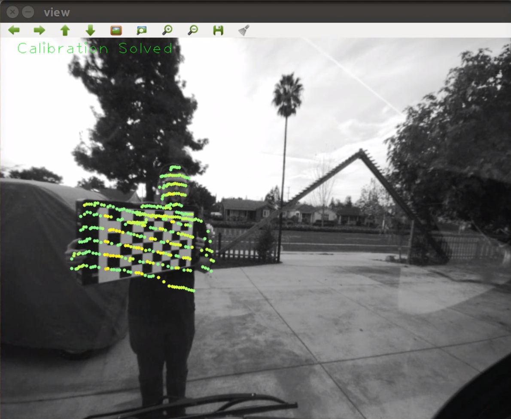

## Lidar Camera Calibration ##

Test of lidar camera calibration using ROS, PCL, OpenCV and Ceres. The software detects 2D image points and corresponding 3D lidar points and then minimizes the reprojection error to determine the calibration parameters.

The checkerboard is detected in the image using the OpenCV detector and the center is used as the image point. The lidar data is filtering and a plane is fit to the board using RANSAC. The centroid of the inliers is taken as long as the remaining points are above a minimum count.

There is a minimum distance between collected points is used to ensure a spread of data. The reprojection error is minimized using Ceres once enough points have been collected.

Ideally the data would have used a reflective surface to make the extraction of the board a little easier in the lidar.

### Build

Run `catkin_make` in the project root directory.

### Run

Run the executable created in `devel/lib/lidar_camera/lidar_camera_node`

Play the bag file run `data.sh`. Make sure the intriniscs have been calculated and added to the bag file first.

#Result

https://youtu.be/x5HLYL_B65g

